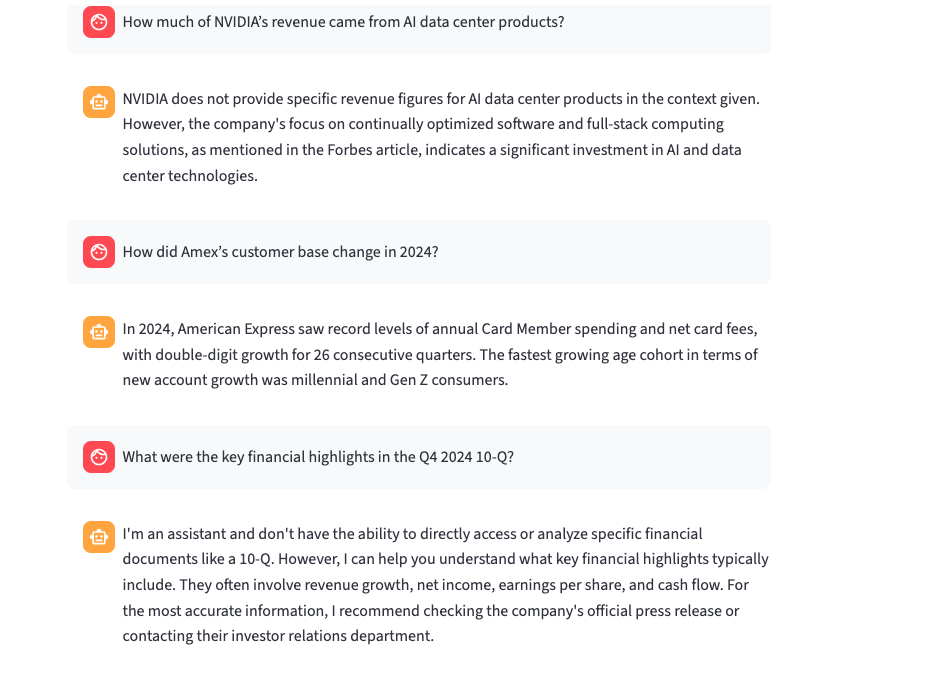

### Chatbot Arayüzü

### 🇹🇷 RAG Chatbot — AKBANK GenAI Bootcamp Projesi
Bu proje, Retrieval-Augmented Generation (RAG) yaklaşımını kullanan bir yapay zekâ sohbet botudur.
Streamlit, LangChain, Pinecone ve Hugging Face teknolojileri ile geliştirilmiştir.
Chatbot, yüklenen şirket raporlarından (örneğin Tesla, NVIDIA, American Express, Apple) bilgi çekerek bağlama uygun, kısa ve net yanıtlar üretir.

### Genel Bakış
Chatbot, kullanıcıdan gelen soruyu vektör formatına dönüştürüp Pinecone veritabanındaki benzer bölümleri bulur.
Ardından bu bölümleri bir LLM (örnek: Mistral-7B-Instruct) ile birleştirerek anlamlı ve bağlama uygun yanıt üretir.

### Kurulum ve Çalıştırma
## 1️⃣ Depoyu Klonla
git clone https://github.com/Talyaakuvvet/rag-chatbot.git
cd rag-chatbot

## 2️⃣ Sanal Ortam Oluştur
python3 -m venv .venv
source .venv/bin/activate

## 3️⃣ Gereksinimleri Yükle
pip install -r requirements.txt

## 4️⃣ Ortam Değişkenlerini Tanımla
.env dosyası:
PINECONE_API_KEY=your_pinecone_api_key
PINECONE_INDEX_NAME=rag-chatbot
PINECONE_REGION=us-east-1
HUGGINGFACEHUB_API_TOKEN=hf_your_token
.streamlit/secrets.toml:
HUGGINGFACEHUB_API_TOKEN = "hf_your_token"

## 5️⃣ Belgeleri İçeri Aktar
python ingestion.py

## 6️⃣ Chatbot’u Başlat
streamlit run chatbot-rag.py

### Chatbot Interface

### 🇬🇧 RAG Chatbot — AKBANK GenAI Bootcamp Project
This project is a Retrieval-Augmented Generation (RAG) chatbot developed using Streamlit, LangChain, Pinecone, and Hugging Face.
It answers questions based on company reports such as Tesla, NVIDIA, American Express, and Apple.

### Overview
The chatbot converts user queries into vector embeddings, retrieves similar chunks from Pinecone,
and generates contextual answers using an LLM like Mistral-7B-Instruct.

### Setup & Run
## 1️⃣ Clone the Repository
git clone https://github.com/Talyaakuvvet/rag-chatbot.git
cd rag-chatbot

## 2️⃣ Create a Virtual Environment
python3 -m venv .venv
source .venv/bin/activate

## 3️⃣ Install Dependencies
pip install -r requirements.txt

## 4️⃣ Configure Environment Variables
# .env file:
PINECONE_API_KEY=your_pinecone_api_key
PINECONE_INDEX_NAME=rag-chatbot
PINECONE_REGION=us-east-1
HUGGINGFACEHUB_API_TOKEN=hf_your_token
# .streamlit/secrets.toml:
HUGGINGFACEHUB_API_TOKEN = "hf_your_token"

## 5️⃣ Ingest Your Documents
python ingestion.py

## 6️⃣ Run the Chatbot
streamlit run chatbot-rag.py

